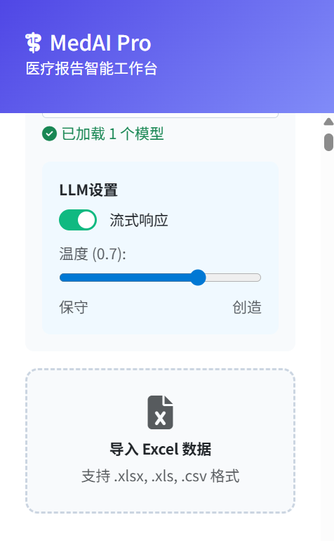

本项目用于医学异常分析
步骤：
1. 创建conda虚拟环境
```
conda create -n medical python=3.10
```
2. 安装所需python库
```
cd AI-medical-abnormal-model-main\backend
conda install requirements.txt
```
3. 运行python后端
```
python app.py
```
4. 侧边栏点击导入excel文件
   
5. 点击判断按钮，系统自动判断项目异常
   
   如上图紫色按钮
6. 点击LLM综述功能，系统自动生成综述
   
   如上图绿色按钮
7. 可以点击导出csv功能的按钮，浏览器将自动下载csv格式的报告（包含所有异常项目和综述）
   
